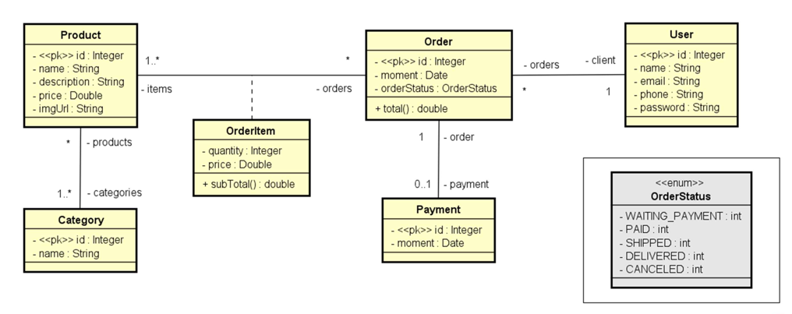
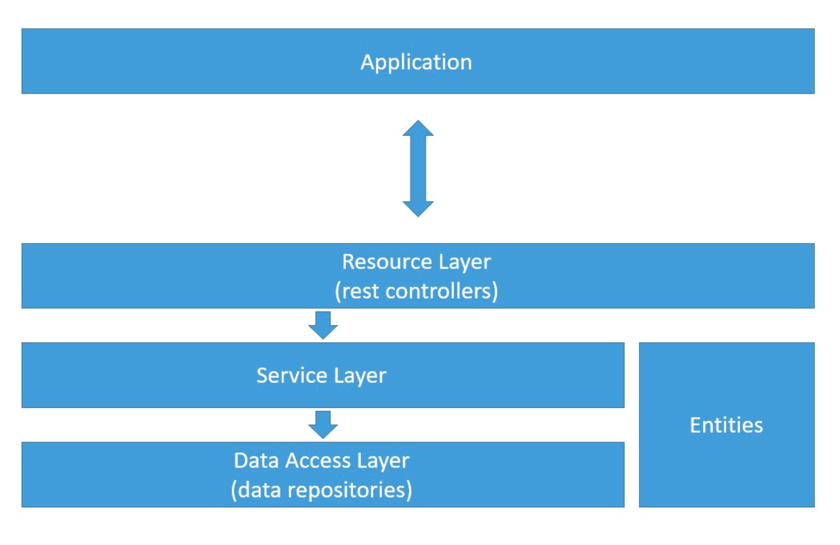

<h1 align="center">Backend App</h1>

This is a web service project made with SpringBoot (java) to learn the fundamentals of Rest API, backend, CRUD and test environments. 

### Tools

The following tools have been used in the project:

- [Spring Boot](https://spring.io/projects/spring-boot)
- [Maven](https://maven.apache.org)
- [H2](https://www.h2database.com/html/main.html)
- [IntelliJ IDEA](https://www.jetbrains.com/idea/)
- [Postman](https://www.postman.com)
- [Apache Tomcat](https://tomcat.apache.org)

---
### Project directions:

The direction to this project was to create a basic test environment with a relational database (H2 in this case) to implement a simple rest API capable of realising CRUD (create, read, update, delete) operations.

#### Domain Model:

#### Logical layers:

---
### Author

Made by Felipe Augusto

---

 
